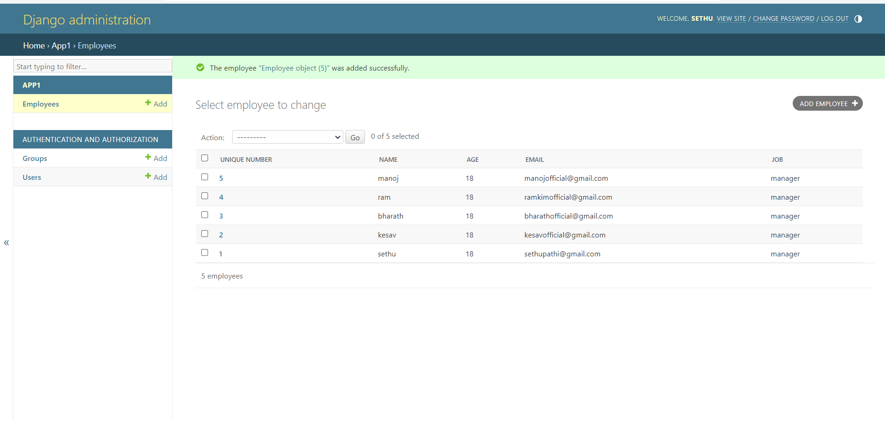

# Ex02 Django ORM Web Application
## Date: 

## AIM
To develop a Django application to store and retrieve data from a Book database using Object Relational Mapping(ORM).

## Entity Relationship Diagram

Include your ER diagram here

## DESIGN STEPS

### STEP 1:
Clone the problem from GitHub

### STEP 2:
Create a new app in Django project

### STEP 3:
Enter the code for admin.py and models.py

### STEP 4:
Execute Django admin and create details for 10 books

## PROGRAM
```python
Model Form:

from django.db import models
from django.contrib import admin

class Employee (models.Model):
    unique_number=models.CharField(max_length=20,primary_key=True)
    name=models.CharField(max_length=100)
    age=models.IntegerField()
    email=models.EmailField()
    job=models.CharField(max_length=100)
class EmployeeAdmin(admin.ModelAdmin):
    list_display=('unique_number','name','age','email','job')

Admin Form:

from django.contrib import admin
from .models import Employee,EmployeeAdmin
admin.site.register(Employee,EmployeeAdmin)

```
## OUTPUT



## RESULT
Thus the program for creating a database using ORM hass been executed successfully
